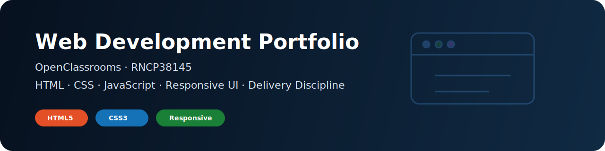

<!-- ═══════════════════════════════════════════════════════════
     KinSushi/OpenClassroomsProject — Web Development Portfolio
     Parcours Developpeur WordPress · RNCP38145
     Part of a broader Data / MLOps engineering trajectory
     ═══════════════════════════════════════════════════════════ -->

<div align="center">



<br/>

# Web Development Portfolio

## OpenClassrooms — Parcours Developpeur WordPress · RNCP38145


</div>

---

## Purpose

This repository documents the **OpenClassrooms Web Developer WordPress path** (RNCP38145) as a public web-development portfolio.

It supports a broader **Data / MLOps engineering trajectory** by proving delivery discipline, semantic HTML, responsive CSS, accessibility awareness, project documentation and Git workflow foundations.

---

## Projects

| # | Project | Description | Stack | Status | Demo |
|---|---|---|---|---|---|
| 03 | Reservia | Travel agency showcase — responsive mobile-first | HTML5 · CSS3 · CSS Variables | Done | [Live](https://kinsushi.github.io/OpenClassroomsProject/) |
| 04 | Ohmyfood | Animations CSS — restaurant ordering UI | HTML5 · CSS3 · SASS | Next | — |
| 05 | Print It | JS DOM manipulation — print shop carousel | HTML5 · CSS3 · JS | Planned | — |
| 06 | Sophie Bluel | JS + API — portfolio architect | HTML5 · CSS3 · JS · REST API | Planned | — |
| 07 | Nina Carducci | Optimization — SEO · a11y · perf | HTML5 · CSS3 · Lighthouse | Planned | — |
| 08 | Kasa | React SPA — rental platform | React · React Router · SASS | Planned | — |
| 09 | Mon Vieux Grimoire | Node.js backend — book rating API | Node.js · Express · MongoDB | Planned | — |
| 10 | Shiny Agency | TDD — React testing | React · Jest · RTL | Planned | — |
| 11 | ArgentBank | Redux — bank auth SPA | React · Redux Toolkit | Planned | — |
| 12 | SportSee | Data dashboards — charts | React · Recharts | Planned | — |
| 13 | WordPress Theme | Custom WP theme — RNCP38145 final | WordPress · PHP · ACF | Planned | — |

---

## Project 03 — Reservia

**Live demo**: [https://kinsushi.github.io/OpenClassroomsProject/](https://kinsushi.github.io/OpenClassroomsProject/)

Key technical decisions:

- 12 CSS custom properties in `:root` for a single source of truth;
- mobile-first layout: base styles for 320px, breakpoints at 768px, 1024px and 1200px;
- semantic HTML5: header, nav, main, section, article, footer;
- filter buttons with `aria-pressed` for screen reader accessibility;
- responsive footer layout with column stacking.

```text
OpenClassroomsProject/
├── index.html         # Reservia — semantic structure
├── styles.css         # CSS variables + mobile-first responsive layout
├── images/            # Visual assets
└── README.md          # Portfolio documentation
```

---

## Why this matters for Data / MLOps roles

| Web-development evidence | Transferable engineering signal |
|---|---|
| Semantic HTML and accessibility | User-facing dashboard and documentation awareness |
| Responsive CSS | Product polish and cross-device testing |
| GitHub Pages demo | Public delivery and deployment habit |
| Conventional Commits | Professional workflow discipline |
| Project documentation | Clear handover and reproducibility mindset |

---

## Workflow

This repository uses **Conventional Commits** and **feature branches**.

```bash
# Branch naming
feature/project-name-description
fix/description
docs/description

# Commit format
feat(projet03): add filter buttons with aria-pressed
fix(projet03): correct card overflow at 768px breakpoint
docs: update README with project 04 status
```

Full workflow reference: [KinSushi/git-workflow-demo](https://github.com/KinSushi/git-workflow-demo)

---

## Certification Target

| Certification | Program | Timeline |
|---|---|---|
| **RNCP38145** — Developpeur Web WordPress | OpenClassrooms | 2025–2026 |
| **RNCP Level 6 / Level 7 track** — Data Science & AI | Jedha | 2026 |

---

## Public-safety note

This repository is public technical evidence. It does not contain CVs, application letters, salary targets, private school documents or employer-specific application material.

---

## Author

**Enzo · KinSushi**  
[GitHub Profile](https://github.com/KinSushi) · [LinkedIn](https://www.linkedin.com/in/enzo-c-di-bacco-074842226)
